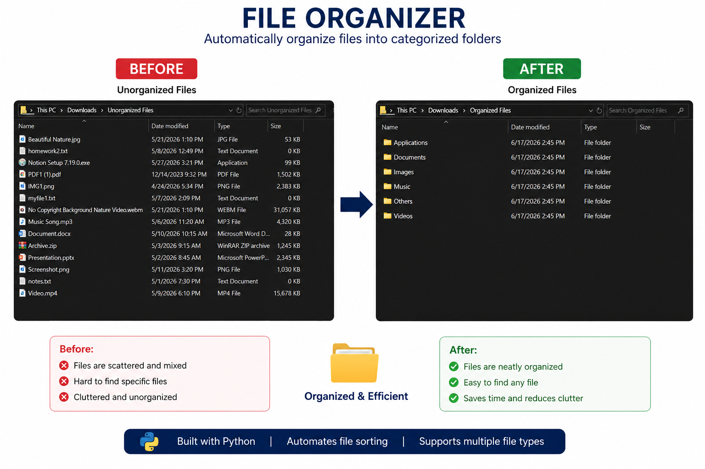

# 📂 File Organizer

A Python automation tool that automatically organizes files into categorized folders based on their file extensions.

Instead of manually sorting files, this script scans a directory and moves files into appropriate folders such as **Documents, Images, Videos, Music, Applications,** and **Others**.

---

## ✨ Features

- 📁 Automatically organizes files by extension
- 🖼️ Separates Images, Documents, Videos, Music, Applications, etc.
- 📂 Creates folders automatically if they don't already exist
- ⚡ Fast and lightweight
- 🐍 Built entirely in Python
- 🔄 Easily customizable for additional file types

---

## 🖼️ Demo

### Before vs After




---

## 📂 Folder Categories

The script currently organizes files into:

- 📄 Documents
- 🖼️ Images
- 🎵 Music
- 🎥 Videos
- 💻 Applications
- 📦 Others

---

## 🚀 Getting Started

### Clone the repository

```bash
git clone https://github.com/yourusername/file-organizer.git
